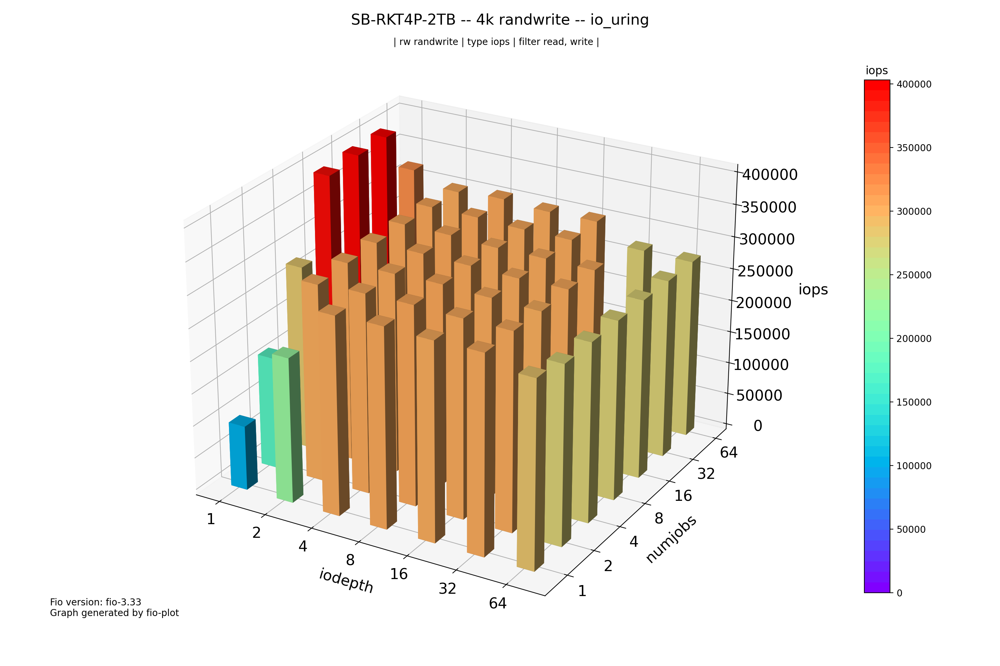
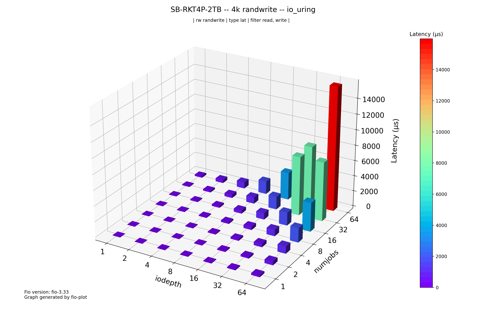

"# FIO Plot Results

This repository contains the results of FIO (Flexible I/O Tester) benchmarks performed on an SB-RKT4P-2TB device, using the `io_uring` engine and `randwrite` mode.

The FIO data was collected using the `bench-fio` tool with the following parameters:

```
bench-fio --engine io_uring --destructive --type device --iodepth 1 2 4 8 16 32 64 --numjobs 1 2 4 8 16 32 64 --mode randwrite --target /dev/nvme0n1 --output SB-RKT4P-2TB
```

## Plots

The plots were generated using `fio-plot` with the following commands:

### IOPS

```
fio-plot -i ./4k -T \"SB-RKT4P-2TB -- 4k randwrite -- io_uring\" -L -t iops -r randwrite
```



### Latency

```
fio-plot -i ./4k -T \"SB-RKT4P-2TB -- 4k randwrite -- io_uring\" -L -t lat -r randwrite
```

"
